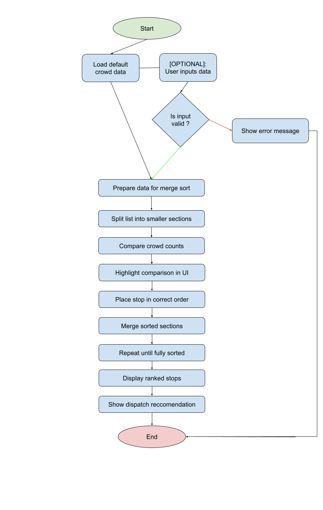
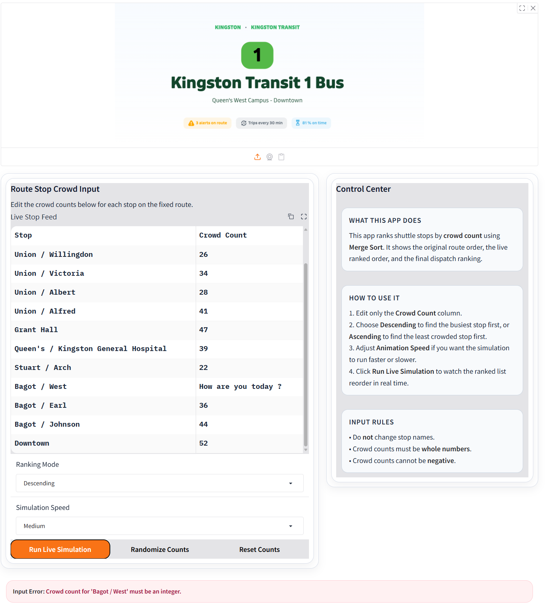
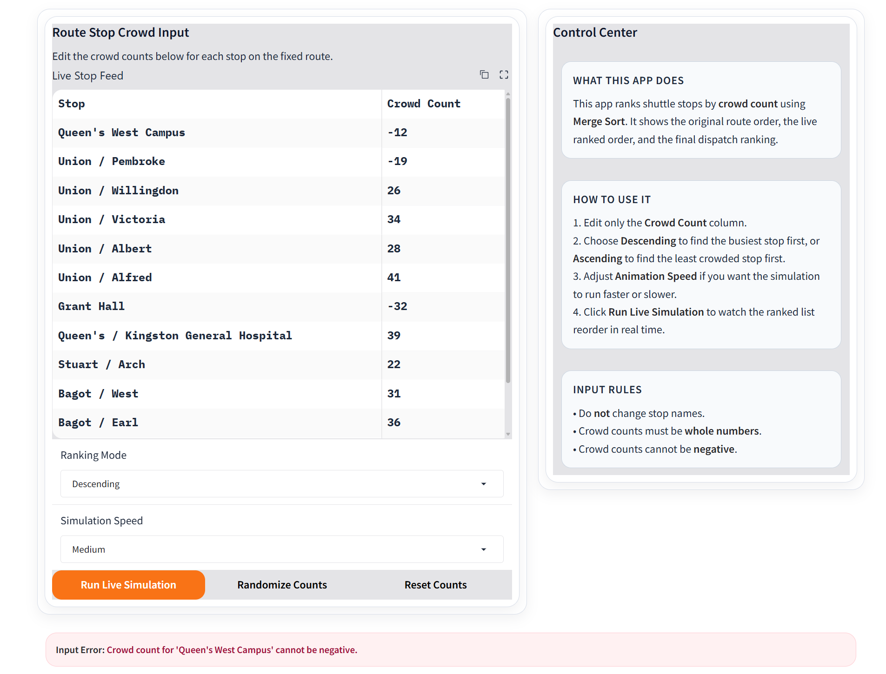
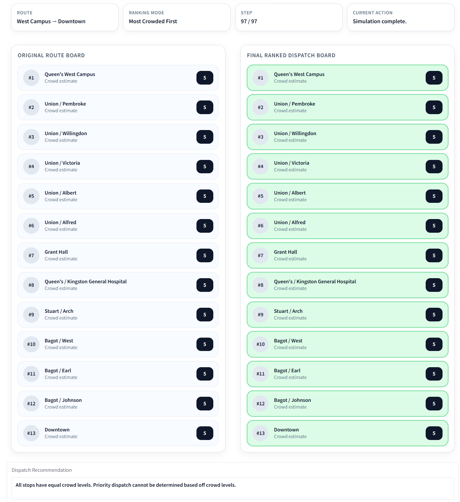

# Campus Shuttle Crowd Ranking (Merge Sort Visualization)

## Chosen Problem

This app solves the **Shuttle Stop Crowd Ranking** problem by ranking campus shuttle stops based on crowd count. The goal is to determine where an extra shuttle should be sent to reduce congestion.

## Chosen Algorithm

This project uses **Merge Sort** to rank stops by crowd count.

Merge Sort was chosen because:

* It is efficient for sorting datasets (O(n log n))
* It clearly demonstrates comparisons and merging steps
* It is well-suited for visualizing how data is divided and combined

This makes it ideal for a teaching-focused simulation.

---

## Demo


---

## Problem Breakdown & Computational Thinking

### Decomposition

* Load stop data (default values or user edits)
* Validate crowd count inputs
* Apply Merge Sort to rank stops
* Display ranked results and recommendation

### Pattern Recognition

* The algorithm repeatedly:

  * Splits the list into smaller sections
  * Compares crowd counts
  * Merges sorted sections

### Abstraction

* The app shows only important actions:

  * Comparisons between stops (highlighted in yellow)
  * Placement into sorted order (highlighted in green)
* Internal implementation details (such as indices and temporary variables) are hidden

### Algorithm Design (Input → Process → Output)

* **Input:** Preloaded crowd data (user can optionally edit values)
* **Process:** Merge Sort divides, compares, and merges stops
* **Output:** Ranked stop list and a dispatch recommendation

### Flowchart:




---

## Steps to Run

1. Install dependencies:
```
pip install -r requirements.txt
```

2. Run the app:
```
python app.py
```
3. Open the local link provided by Gradio in your browser

---

## Hugging Face Link

https://huggingface.co/spaces/mouct6r/CISC_121_Final_Project
---

## Testing & Verification

### Test 1: Normal Case

Input: Default crowd values

Expected: Stops sorted correctly

Result: Correct output produced

### Test 2: Already Sorted Input

Input:
Stops entered in descending order of crowd count

Expected:
The list should remain unchanged, but the algorithm should still process all steps of Merge Sort.

Result:
The app maintained the correct order and still displayed the full step-by-step simulation.

### Test 3: Invalid Input (Non-integer)

Input: Letters or invalid values

Expected: Error message

Result: Error displayed

Screenshot evidence:


### Test 4: Negative Values


Input: Negative crowd count

Expected: Error message

Result: Error displayed

Screenshot evidence:


### Test 5: Equal Crowd Counts

Input: All stops have the same crowd value

Expected:
- Order remains stable
- No single stop prioritized

Result:
- Merge Sort preserves order
- Correct message shown

Screenshot evidence:


### Summary
Prior to creating app.py I wanted to make sure all the code in this file knew its place, with I being the ultimate ruler, and the code being my royal pawns. Therefore I was not surprised when the application correctly sorted stops under normal and edge-case conditions, maintained stability when values were equal, and properly handlesd invalid inputs by displaying clear error messages. 
Cool calm and collected, mission completed. 

---

## Author & Acknowledgment

Author: Mouctar Diallo 

AI Use:
AI tools (ChatGPT) were used to assist with debugging, UI design improvements, and documentation refinement. All algorithm logic and final implementation decisions were my own.
